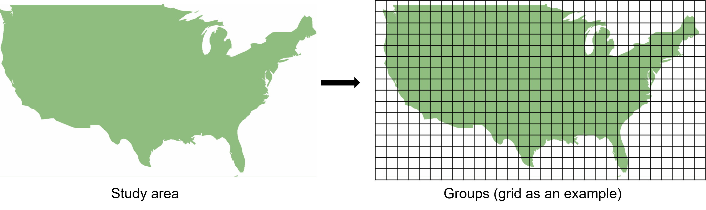

# Spatial Transformation Framework for Deep Learning (GeoDL)

The tree-based version is at: [Tree-based-models](/Tree-based-models)

## Major updates
- Added a new class `GeoDL` in `GeoDL.py` with standard functions: `fit`, `predict`, and `evaluate`.
- Added a simplified demo script `STAR_main.py` to show end-to-end usage.
- Standardized configuration in `config.py` (with a compatibility shim `paras.py`).

## Key differences from standard deep learning
- GeoDL requires an additional input `X_group` that assigns each sample to a spatial group.
- Groups are the minimum spatial units for partitioning. You can define them using raw coordinates or grid-based locations.

## Sample demo data
- Features X ([X_demo.npy](https://drive.google.com/file/d/1sLM2Los_OHiJho2byLBMYLqkW_LEFtA5/view?usp=drive_link))
- Labels y ([y_demo.npy](https://drive.google.com/file/d/1CvX9n6mIM4jmFpSbfagjCvFhx3eok-fT/view?usp=drive_link))
- Locations X_loc ([X_loc_demo.npy](https://drive.google.com/file/d/1etm32pt1dbvdFaLF9pFZesak12AE-4X2/view?usp=drive_link))

## Example usage
For details, please refer to [GeoDL_main.py](GeoDL_main.py).

Create a new model:
```
geodl = GeoDL(model_choice="DNN")#Vanilla network as an example
```
Define groups of data points (minimum spatial units in partitioning):
```
group_gen = GroupGenerator(xmin, xmax, ymin, ymax, cell_size)#example using grid cells to define groups
X_group = group_gen.get_groups(X_loc)#convert locations to group IDs
```

Train GeoDL (i.e., STAR or geo-aware deep learning):
```
georf.fit(X, y, X_group)#locations grouped in X_group
```

Make predictions:
```
geodl.predict(X_test, X_test_group)
```
Evaluate model:
```
geodl.evaluate(X_test, y_test, X_test_group)#X_test_group is generated in the same way as training
```
