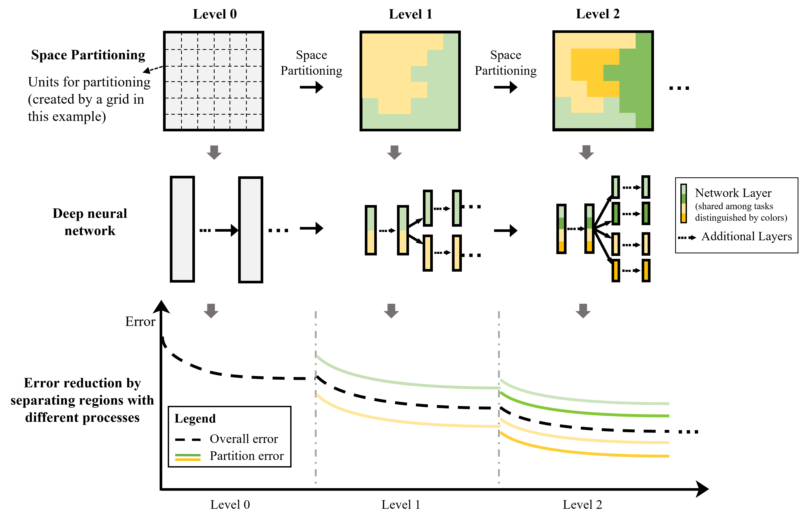

# STAR (a <ins>s</ins>patial <ins>t</ins>ransformation <ins>a</ins>nd mode<ins>r</ins>ation framework)
Learning for data with heterogeneity (ICDM'21 Best Paper Award)

This repository includes several versions of the framework for different types of machine learning models, organized by different folders:
* [Deep-learning-models](Deep-learning-models): Fully-connected, convolutional, recurrent, ...
* [Tree-based-models](Tree-based-models): Random forest
* **Demo and model-specific ReadMe available in the two folders.**

## Paper information

**[ICDM'21]** Yiqun Xie*, Erhu He*, Xiaowei Jia, Han Bao, Xun Zhou, Rahul Ghosh and Praveen Ravirathinam. A Statistically-Guided Deep Network Transformation and Moderation Framework for Data with Spatial Heterogeneity. IEEE International Conference on Data Mining (ICDM'21), 2021.

**[IJCAI'22]** Yiqun Xie*, Erhu He*, Xiaowei Jia, Han Bao, Xun Zhou, Rahul Ghosh and Praveen Ravirathinam. Statistically-Guided Deep Network Transformation to Harness Heterogeneity in Space (Extended Abstract). The 31st International Joint Conference on Artificial Intelligence (IJCAI'22), Sister Conference Best Paper Track. Invited. 2022.

**[RSE'25]** Yiqun Xie, Anh Nhu, Xiao-Peng Song, Xiaowei Jia, Sergii Skakun, Haijun Li, Zhihao Wang. Accounting for Spatial Variability with Geo-aware Random Forest: A Case Study for US Major Crop Mapping. Remote Sensing of Environment, 2024. [Extension for ensemble models using random forest as an example for the remote sensing field]

```
@inproceedings{xie2021statistically,
  title={A statistically-guided deep network transformation and moderation framework for data with spatial heterogeneity},
  author={Xie, Yiqun and He, Erhu and Jia, Xiaowei and Bao, Han and Zhou, Xun and Ghosh, Rahul and Ravirathinam, Praveen},
  booktitle={2021 IEEE International Conference on Data Mining (ICDM)},
  pages={767--776},
  year={2021},
  organization={IEEE}
}

@inproceedings{xie2022statistically,
  title     = {Statistically-Guided Deep Network Transformation to Harness Heterogeneity in Space (Extended Abstract)},
  author    = {Xie, Yiqun and He, Erhu and Jia, Xiaowei and Bao, Han and Zhou, Xun and Ghosh, Rahul and Ravirathinam, Praveen},
  booktitle = {Proceedings of the Thirty-First International Joint Conference on Artificial Intelligence, {IJCAI-22}},
  pages     = {5364--5368},
  year      = {2022},
  note      = {Sister Conferences Best Papers}
}
```

## High-level illustration:

